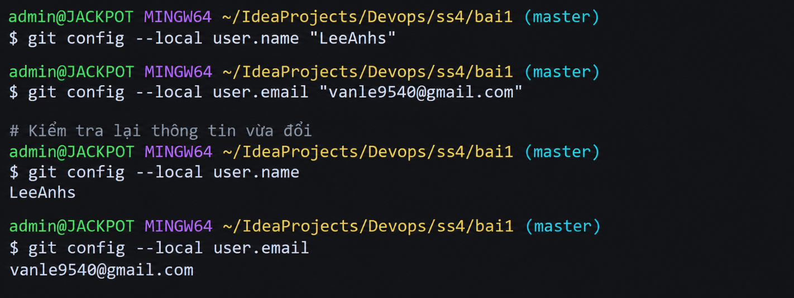

# Bài 1: Khởi tạo Local Repository và Cấu hình danh tính

## 1. Mục tiêu
- Khởi tạo Git repository trống tại thư mục làm việc cục bộ.
- Thiết lập thông tin tác giả (tên và email) ở cấp độ cục bộ `--local`.
- Tạo tệp, đưa vào Staging Area và commit đầu tiên.
- Đọc trạng thái và lịch sử commit bằng `git status`, `git log`.

## 2. Các lệnh đã thực hiện

Khởi tạo repo tại thư mục dự án:
```bash
cd "C:/Users/admin/IdeaProjects/Devops/ss4/bai1"
git init
```

Cấu hình danh tính cục bộ (bắt buộc `--local`, không dùng `--global`):
```bash
git config --local user.name "hoangduong"
git config --local user.email "hoangduong2062006@gmail.com"
```

Kiểm tra cấu hình:
```bash
git config --local user.name
git config --local user.email
git config --local --list
```

Đưa file vào Staging Area và commit đầu tiên:
```bash
git status
git add .
git commit -m "Initial commit: khoi tao du an"
```

Xem lịch sử commit và trạng thái:
```bash
git log --oneline
git status
```

## 3. Kết quả minh chứng

`git config --local --list`:
```
core.repositoryformatversion=0
core.filemode=false
core.bare=false
core.logallrefupdates=true
core.symlinks=false
core.ignorecase=true
user.name=hoangduong
user.email=hoangduong2062006@gmail.com
```

`git log --oneline`:
```
9f7b434 (HEAD -> master) Initial commit: khoi tao du an
```

`git status`:
```
On branch master
nothing to commit, working tree clean
```

## 4. Ảnh chụp màn hình


